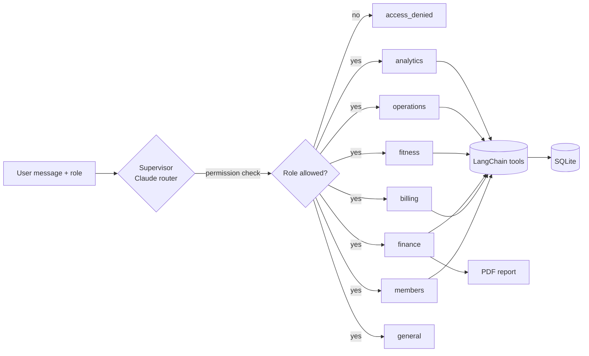

# 🏋️ Gym AI - AI Gym Management System

A multi-agent AI system that runs a gym through plain conversation, built with **LangChain**, **LangGraph** and **Claude**.
Ask in everyday language, for example *"Ali paid 5000 by JazzCash"* or *"Show me this month's profit"*, and the right
specialist agent does the work on a real database.

Built by **Abdul Basit**, with Claude as the AI engine and coding partner.

## ✨ Features

| Area | What it does |
|---|---|
| **Members** | Register, search, update, deactivate, membership plans (Monthly / Quarterly / Yearly) |
| **Payments** | Record every payment with **amount, payment method, exact date & time**, auto receipt number, automatic membership extension |
| **PDF report** | One monthly PDF with **all members + fees + payment date/time/method, staff salaries, expenses and net profit** |
| **Staff & salaries** | Staff list, monthly salaries, paid/unpaid tracking with date, time and method |
| **Expenses** | Rent, electricity, equipment, maintenance, marketing... per month |
| **Attendance** | Check-in that denies entry to expired/unpaid members |
| **Classes** | Schedules, bookings, capacity, waitlist with automatic promotion |
| **AI fitness coach** | Workout plans and diet plans; calories/macros calculated in code (Mifflin-St Jeor), then explained by Claude |
| **Progress tracking** | Weight and body-fat history with trend |
| **Equipment** | Fault reports and service dates |
| **Sales leads** | Capture and follow up inquiries |
| **Reminders** | Renewal and overdue-fee messages (delivery simulated; plug in WhatsApp/SMS) |
| **Analytics** | Dashboard numbers and plain-language questions answered with read-only SQL |
| **Safety** | Role-based access, confirmation before moving money, read-only SQL sandbox |

## 🧠 How it works



1. The **supervisor** (Claude with structured output) reads the message and picks one specialist.
2. A **permission check** compares the choice to the user's role (`owner`, `admin`, `trainer`, `member`).
3. The **specialist agent** (a LangChain tool-calling agent) calls tools that read or write the database.
4. A LangGraph **checkpointer** keeps conversation memory per `thread_id`.

More detail in [docs/architecture.md](docs/architecture.md).

## 🚀 Quick start

```bash
git clone https://github.com/<your-username>/gym-management-ai.git
cd gym-management-ai
python -m venv .venv && source .venv/bin/activate      # Windows: .venv\Scripts\activate
pip install -r requirements.txt

cp .env.example .env          # then put your ANTHROPIC_API_KEY inside
python seed_data.py           # optional: fictional demo data
python main.py chat --role owner
```

Things that work **without** an API key:

```bash
python main.py report --month 2026-09   # PDF report -> reports/
python main.py dashboard                # gym statistics
pytest                                  # all tests
```

### Example conversation

```
You: Register Sara Noor, phone 0301-1234567, monthly plan
You: Sara paid 5000 by Easypaisa
You: Who is overdue?
You: Pay Ahmed Raza's salary for September by bank transfer     -> asks for confirmation first
You: Create the PDF report for September
You: Make a 4-day fat-loss workout and meal plan for member 3
You: How many members joined in the last 60 days?               -> analytics (read-only SQL)
```

### Web API (optional)

```bash
uvicorn api:app --reload      # docs at http://127.0.0.1:8000/docs
```
Endpoints: `POST /chat`, `GET /dashboard`, `GET /reports/monthly?month=2026-09`.
The demo API has no login; add authentication before exposing it publicly.

## 📄 The PDF report

A sample is included: [docs/sample_report.pdf](docs/sample_report.pdf) (fictional data). Sections:
1. Overview numbers
2. All members: plan fee, fee status, last payment **date & time** and **method**
3. Payment ledger for the month
4. Staff salaries: paid/unpaid, date & time, method
5. Expenses
6. Financial summary: income - expenses - salaries = net profit

## 🗂 Project structure

```
gym-management-ai/
├── main.py              # command line: chat / report / dashboard
├── api.py               # optional FastAPI web API
├── seed_data.py         # fictional demo data
├── gym_ai/
│   ├── config.py        # all settings (gym name, currency, model...)
│   ├── database.py      # SQLite tables
│   ├── utils.py         # dates, money, errors
│   ├── services/        # business logic - plain Python, no AI (members, payments, staff,
│   │                    #   expenses, attendance, classes, nutrition, reports, pdf_report ...)
│   ├── tools/           # thin LangChain @tool wrappers around the services
│   └── agents/
│       ├── prompts.py   # every AI instruction in one file
│       ├── roles.py     # who may use which agent
│       ├── specialists.py  # builds the tool-calling agents
│       └── graph.py     # the LangGraph workflow
├── tests/               # pytest, includes graph tests with a fake model
└── docs/
```

**Design rule:** the AI never touches the database directly. Business rules live in `services/` (easy to test and read);
`tools/` expose them to Claude; `agents/` decide when to call them.

## 🔒 Safety design

- **Role-based access:** a trainer asking for salaries is stopped by the graph before any finance agent runs.
- **Human confirmation:** sensitive tools (`pay_salary`, `deactivate_member`) refuse to run until the user approves (`confirmed=True`).
- **Read-only SQL:** a single `SELECT` only, keyword filter, and a database connection opened in read-only mode.
- **No invented data:** prompts require tool use; tool errors are returned to the AI as readable messages.

## ✅ Testing

```bash
pytest -q
```
Covers payments and membership extension, partial payments, check-in rules, class waitlists, salary double-pay protection,
profit maths, nutrition formulas, SQL sandbox, PDF contents, and the LangGraph flow (routing, tool calls, role denial,
confirmation gate, per-thread memory). The graph tests use a small fake model (`tests/fake_llm.py`) so they run without an API key
and test this project's wiring, not Claude's responses.

## ⚠️ Known limitations

- Conversation memory is in-process (`MemorySaver`); swap in a SQLite/Postgres checkpointer for persistence.
- Reminder delivery is simulated; connect a real WhatsApp/SMS provider in `services/notifications.py`.
- A `member` role is limited by agent, not yet tied to one member's own records.
- Fitness and nutrition output is general guidance, not medical advice.
- Partial payments are recorded but the remaining balance is not tracked.

## 🛣 Roadmap ideas

Member self-service portal · WhatsApp integration · persistent LangGraph checkpointer · Postgres · Streamlit dashboard · login/JWT.

## 📜 License

MIT, see [LICENSE](LICENSE).
